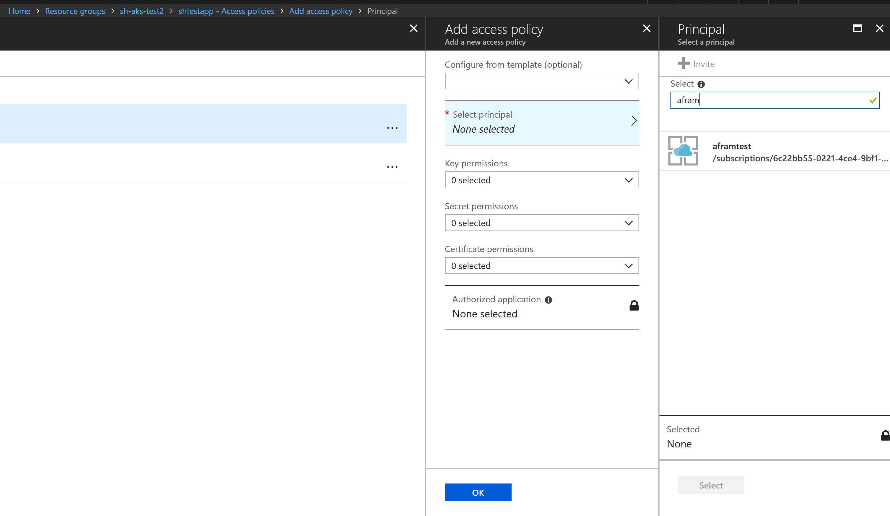
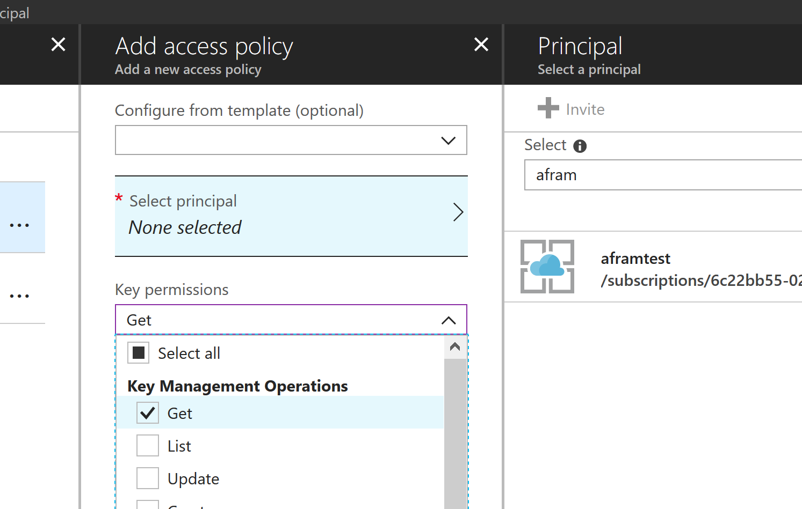

# Running Azure Function

## Running locally

To run Azure Function locally you need the latest version of Visual Studio and Azure Function tools.

Open the solution `SmartHotel360.AzureFunction.sln` and edit the `local.settings.json` file with following entries in `Values` section:

* `cosmos_uri`: URL of the CosmosDb (SQL API) to use
* `cosmos_key`: Key of the CosmosDb (SQL API) to use
* `constr`: Connection String for the CosmosDb (SQL API) to use
* `MicrosoftVisionApiKey`: API Key for Vision API
* `MicrosoftVisionApiEndpoint`: Vision API endpoint (i. e. https://eastus2.api.cognitive.microsoft.com/vision/v1.0/)
* `MicrosoftVisionNumTags`: Tags to fetch from Vision API
* `KeyVaultUri`: Uri of the KeyVault to retrieve the secrets. **Leave it blank to not use key vault**
* `AzureSignalRConnectionString`: Connection string to [Azure SignalR](https://azure.microsoft.com/en-us/services/signalr-service/) resource to use.

## Deploy to Azure

To deploy the Azure Function to azure just publish it from Visual Studio followin the instructions in the "Publish to Azure" section of the [AF documentation]
(https://docs.microsoft.com/en-us/azure/azure-functions/functions-develop-vs).

## Creating needed Azure resources

AF needs some Azure resources to be created and setup:

1. Create Azure SignalR by deploying the ARM script `./deploy/azure-signalr.json`
2. Create CosmosDb by running the script `./deploy/03-deploy-cosmos.sh`
3. (If wanted) Create the Azure Key Vault (more on this later).

## Using a Key Vault

[Azure Key Vault](https://azure.microsoft.com/en-us/services/key-vault/) can be used to store all secrets for the Azure function. Key vault **works only when the Azure Function is deployed in Azure**.

To setup an Azure Key Vault just open a Bash propmt and perform following tasks (**note**: If in Windows can use WSL):

```
export KEYVAULT_NAME=<name-of-the-keyvault-to-create>
export AF_RG=<name-of-the-resource-group>
export AF_REGION=<name of the azure region (i.e. eastus)>
 ./deploy-keyvault.sh
```

This script will create the Azure Key Vault in the specified resource group. To set the azure subscription to use, run the command `az account set` from the Azure CLI 2.0.

Once key vault is created you can run the script `/deploy/set-secrets-keyvault.sh` to fill the Key Vault with your secrets. To do it:

```
export KEYVAULT_NAME=<name-of-the-keyvault-to-use>
./set-secrets-keyvault.sh secret1=value1 secret2=value2
```

**Note**: The secrets have the same name defined in `local.settings.json` but **removing all underscores** (i. e. `cosmos_uri` becomes `cosmosuri` in Key Vault).

Finally to force the AF to use the key vault you must set `KeyVaultUri` setting of the AF to the uri of the Key Vault.

Once step more is required: give AF permissions to use Key Vault. By default Azure Functions use [MSI](https://docs.microsoft.com/en-us/azure/active-directory/managed-identities-azure-resources/overview) which means that we don't need to pass the keys to Azure Function to allow Key Vault access, but need to configure Key Vault to share secrets with the Azure Function.

To do it, open the Azure portal, and navigate to your Key Vault. Go to "Access Policy -> Add Access Policy" and search for the function app:



Then in "Key Permitions" add the "Key Management Operation GET" permission, to allow the Azure Function access to Key Vault:



**Note** If any secret is not found in Key Vault, the environment variable (function app setting) is used instead.